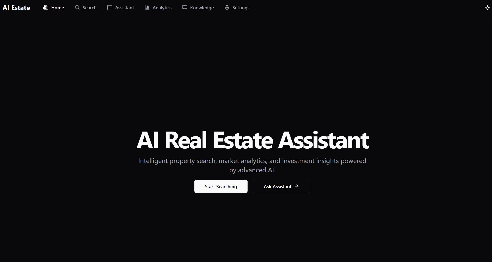
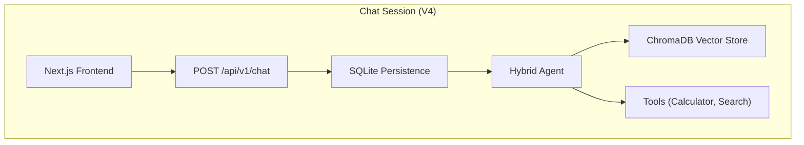

# 🏠 AI Real Estate Assistant

> AI-powered assistant for real estate agencies that helps buyers and renters find their ideal property.

[](https://python.org)
[](https://fastapi.tiangolo.com/)
[](https://nextjs.org/)
[](https://github.com/AleksNeStu/ai-real-estate-assistant/actions/workflows/ci.yml)
[](LICENSE)

## 💖 Support the Ecosystem

[](https://github.com/sponsors/AleksNeStu)
[](https://www.buymeacoffee.com/AleksNeStu)
[](https://ko-fi.com/AleksNeStu)

If you find my tools helpful and want to support the development of practical, open-source AI systems, you can contribute here:

| Platform | Link |
| :--- | :--- |
| GitHub Sponsors | https://github.com/sponsors/AleksNeStu |
| Buy Me a Coffee | https://www.buymeacoffee.com/AleksNeStu |
| Ko-fi | https://ko-fi.com/AleksNeStu |

> Your support helps cover compute costs, API usage, and specialized data services, and keeps the tools free and accessible.



## 🌿 Branching & Versioning

We follow a structured branching strategy. **Active development happens in `dev`**.

| Branch | Status | Description |
|--------|--------|-------------|
| **[`dev`](https://github.com/AleksNeStu/ai-real-estate-assistant/tree/dev)** | **🔥 Active** | **Current Development**. All new features and fixes land here. |
| **[`main`](https://github.com/AleksNeStu/ai-real-estate-assistant/tree/main)** | 🟢 Stable | Production-ready releases. |
| **[`ver4`](https://github.com/AleksNeStu/ai-real-estate-assistant/tree/ver4)** | 🟡 Legacy | Previous V4 development branch (Frozen). |
| **[`ver3`](https://github.com/AleksNeStu/ai-real-estate-assistant/tree/ver3)** | ❄️ Archived | Legacy Streamlit version. |
| **[`ver2`](https://github.com/AleksNeStu/ai-real-estate-assistant/tree/ver2)** | ❄️ Archived | Early prototype. |

Releases are tracked with tags (SemVer), e.g. **[`v1.0.0`](https://github.com/AleksNeStu/ai-real-estate-assistant/releases/tag/v1.0.0)**.


## 🌟 Overview

The AI Real Estate Assistant is a modern, conversational AI platform helping users find properties through natural language. Built with a **FastAPI** backend and **Next.js** frontend, it features semantic search, hybrid agent routing, and real-time analytics.

**[Docs](docs/README.md)** | **[User Guide](docs/user/USER_GUIDE.md)** | **[Backend API](docs/api/API_REFERENCE.md)** | **[Developer Notes](docs/development/DEVELOPER_NOTES.md)** | **[Troubleshooting](docs/development/TROUBLESHOOTING.md)** | **[Testing](docs/testing/TESTING_GUIDE.md)** | **[Contributing](docs/development/CONTRIBUTING.md)**

---

## ✨ Key Features

### 🤖 Multiple AI Model Providers
- **OpenAI**: GPT-4o, GPT-4o-mini, O1, O1-mini
- **Anthropic**: Claude 3.5 Sonnet, Claude 3.5 Haiku, Claude 3 Opus
- **Google**: Gemini 1.5 Pro, Gemini 1.5 Flash, Gemini 2.0 Flash
- **Grok (xAI)**: Grok 2, Grok 2 Vision
- **DeepSeek**: DeepSeek Chat, DeepSeek Coder, R1
- **Ollama**: Local models (Llama 3, Mistral, Qwen, Phi-3)

### 🧠 Intelligent Query Processing
- **Query Analyzer**: Automatically classifies intent and complexity
- **Hybrid Agent**: Routes queries to RAG or specialized tools
- **Smart Routing**: Simple queries → RAG (fast), Complex → Agent+Tools
- **Multi-Tool Support**: Mortgage calculator, property comparison, price analysis

### 🔍 Advanced Search & Retrieval
- **Persistent ChromaDB Vector Store**: Fast, persistent semantic search
- **Hybrid Retrieval**: Semantic + keyword search with MMR diversity
- **Result Reranking**: 30-40% improvement in relevance
- **Filter Extraction**: Automatic extraction of price, rooms, location, amenities

### 💎 Enhanced User Experience
- **Modern UI**: Next.js App Router with Tailwind CSS
- **Real-time**: Streaming responses from backend
- **Interactive**: Dynamic property cards and map views

---

## 🏗️ Architecture



---

## 🚀 Quick Start

### 🐳 Docker (Fastest Way)
The easiest way to run the full stack locally.

**Requires:** At least one external API key (OpenAI, Anthropic, Google, etc.)

```powershell
# 1. Prepare environment
Copy-Item .env.example .env
# Edit .env to add your API keys (OPENAI_API_KEY, ANTHROPIC_API_KEY, etc.)

# 2. Run with Docker Compose (external AI models)
docker compose -f deploy/compose/docker-compose.yml up --build

# 3. Access
# Frontend: http://localhost:3000
# Backend API: http://localhost:8000/docs
```

#### Optional: Local LLM with Ollama

> **Note:** Local LLM with Ollama requires GPU for good performance.

```powershell
# Run with Ollama for local models
docker compose -f deploy/compose/docker-compose.yml --profile local-llm up --build
```

### 🐍 Manual Setup

#### 1. Backend (FastAPI)

#### Windows (PowerShell)
```powershell
git clone https://github.com/AleksNeStu/ai-real-estate-assistant.git
cd ai-real-estate-assistant

# Install uv (fast Python package manager)
pip install uv

# Create virtual environment and install dependencies
uv venv .venv
.\.venv\Scripts\Activate.ps1
uv pip install -e .[dev]

Copy-Item .env.example .env
# Edit .env and set provider API keys and ENVIRONMENT
# Set ENVIRONMENT="local"

python -m uvicorn api.main:app --reload --host 0.0.0.0 --port 8000
```

#### macOS/Linux
```bash
git clone https://github.com/AleksNeStu/ai-real-estate-assistant.git
cd ai-real-estate-assistant

# Install uv (fast Python package manager)
pip install uv

# Create virtual environment and install dependencies
uv venv .venv
source .venv/bin/activate
uv pip install -e .[dev]

cp .env.example .env
# Edit .env and set provider API keys and ENVIRONMENT
# Set ENVIRONMENT="local"

python -m uvicorn api.main:app --reload --host 0.0.0.0 --port 8000
```

### 2. Frontend (Next.js)

```bash
cd apps/web
npm install
npm run dev
```

Open `http://localhost:3000` (frontend). The backend runs at `http://localhost:8000`.

## 🧪 Testing

We use `pytest` for backend testing and `jest` for frontend testing.

```bash
# Backend Tests
cd apps/api
python -m pytest tests/unit          # Unit tests
python -m pytest tests/integration   # Integration tests

# Frontend Tests
cd apps/web
npm test
```

### Using Makefile

For quick commands, use the Makefile:

```bash
make help        # Show all available commands
make test        # Run all tests
make lint        # Run linting
make security    # Run security scans
make dev         # Start development servers
make docker-up   # Start Docker containers
make ci          # Run full CI locally
```

---

## 🚀 Deployment

### Quick Start

| Component | Platform | Status |
|-----------|----------|--------|
| Frontend | [Vercel](https://vercel.com) | Automated from GitHub |
| Backend | Render, Railway, Fly.io | Manual deployment |

### Environment Variables Matrix

| Environment | `NEXT_PUBLIC_API_URL` | `BACKEND_API_URL` |
|-------------|----------------------|-------------------|
| Local | `/api/v1` (uses Next.js proxy) | `http://localhost:8000/api/v1` |
| Production | `/api/v1` (uses Next.js proxy) | `https://your-backend.com/api/v1` |

### Key Security Design

- **API Access Key**: Set in Vercel dashboard (server-side only), never exposed to browser
- **API Proxy**: Frontend calls `/api/v1/*` which proxies to backend, injecting `X-API-Key` server-side
- **No Public Secrets**: `NEXT_PUBLIC_*` variables never contain sensitive data

**For complete deployment instructions**, see [DEPLOYMENT.md](docs/deployment/DEPLOYMENT.md).

---

## 🧹 Maintenance

### Code Quality

The project uses `ruff` for Python linting and formatting.

```bash
python -m ruff check .
```

### Pre-Commit Hooks

This project includes a 3-layer pre-commit security system that runs automatically before each commit:

1. **Gitleaks** - Secret scanning (API keys, passwords, tokens)
2. **Semgrep** - SAST for Python security vulnerabilities (CI/CD only)
3. **Lint-staged** - Frontend code quality (Prettier + ESLint)

#### Installation

```bash
# After cloning, install the hooks
pre-commit install

# Install required tools
scoop install gitleaks  # Windows (or use choco)
pip install semgrep     # Optional: for local SAST
npm install             # For lint-staged and prettier
```

#### Running Hooks Manually

```bash
# Test all files
pre-commit run --all-files

# Run on staged files (automatic before commit)
git commit

# Skip temporarily if needed
git commit --no-verify
```

#### Configuration Files

- [`.gitleaks.toml`](.gitleaks.toml) - Secret detection rules
- [`semgrep.yml`](semgrep.yml) - Security scanning rules
- [`.pre-commit-config.yaml`](.pre-commit-config.yaml) - Hook configuration
- [`.prettierrc`](.prettierrc) - Code formatting config
- [`package.json`](package.json) - lint-staged configuration

### Local Security Scanning

For full CI/CD security parity, you can run all security checks locally:

```bash
# Run all security scans (Gitleaks, Semgrep, Bandit, pip-audit)
python scripts/security/local_scan.py

# Run specific scan only
python scripts/security/local_scan.py --scan-only=secrets    # Gitleaks
python scripts/security/local_scan.py --scan-only=semgrep    # Semgrep SAST
python scripts/security/local_scan.py --scan-only=bandit     # Bandit Python security
python scripts/security/local_scan.py --scan-only=pip-audit  # Dependency vulnerabilities

# Quick mode (skip slower pip-audit scan)
python scripts/security/local_scan.py --quick

# Verbose output
python scripts/security/local_scan.py --verbose
```

**Docker Fallback:** On Windows, if Gitleaks or Semgrep binaries aren't installed, the script automatically uses Docker containers.

**Tool Installation:**

```bash
# Optional: Install tools locally for faster execution
scoop install gitleaks   # Windows (or brew install gitleaks on macOS)
pip install semgrep       # SAST scanning
pip install bandit        # Python security (already in dev dependencies)
pip install pip-audit     # Dependency auditing (already in dev dependencies)
```

---

## ⚙️ Configuration

Core configuration is controlled via environment variables and `.env`:

```bash
# Required (at least one provider)
OPENAI_API_KEY="<OPENAI_API_KEY>"
ANTHROPIC_API_KEY="<ANTHROPIC_API_KEY>"
GOOGLE_API_KEY="<GOOGLE_API_KEY>"

# Backend
ENVIRONMENT="local"
CORS_ALLOW_ORIGINS="http://localhost:3000"

# Optional
OLLAMA_BASE_URL="http://localhost:11434"
SMTP_USERNAME="..."
SMTP_PASSWORD="..."
SMTP_PROVIDER="sendgrid"
```

Frontend-specific variables (optional) go into `frontend/.env.local`.

---

## 🤖 Local Models (Ollama)

1. **Install Ollama**: [ollama.com](https://ollama.com)
2. **Pull Model**: `ollama pull llama3.3`
3. **Configure**: Set `OLLAMA_BASE_URL="http://localhost:11434"` in `.env`
4. **Select**: Choose "Ollama" in the frontend provider selector.

---

## 🧪 Development & Testing

- **Backend Tests**: `cd apps/api && pytest`
- **Frontend Tests**: `cd apps/web && npm test`
- **Linting**: `cd apps/api && ruff check .` (Python), `cd apps/web && npm run lint` (Frontend)
- **Security**: `python scripts/security/local_scan.py`

See `docs/testing/TESTING_GUIDE.md` for details.

---

## 🚀 One-Command Start (Docker)

```powershell
# CPU
.\scripts\docker\cpu.ps1

# GPU (if available)
.\scripts\docker\gpu.ps1

# GPU + Internet web research (starts the `internet` compose profile)
.\scripts\docker\gpu-internet.ps1
```

If you prefer a single entrypoint:

```powershell
python scripts/start.py --mode docker --docker-mode auto
python scripts/start.py --mode docker --docker-mode gpu --internet
```

---

## 🗄️ Optional Redis (MCP/Caching)

For MCP tooling or future caching/session features, a local Redis service is included in Docker Compose.

```powershell
# Start only Redis
docker compose up -d redis

# Or start all services (backend, frontend, redis)
docker compose up -d --build
```

Configure clients via:

```bash
REDIS_URL="redis://localhost:6379"
```

---

## 🤝 Contributing

Contributions are welcome. See [CONTRIBUTING.md](CONTRIBUTING.md) for the full workflow.

1. Fork the repository
2. Create a feature branch (`git checkout -b feature/short-description`)
3. Run checks locally
4. Commit using the format `type(scope): message [IP-XXX]`
5. Open a Pull Request against `main`

---

## 🔧 Troubleshooting

See `docs/development/TROUBLESHOOTING.md` for detailed help.

### Common Issues

**Port already in use (8000)**:
```powershell
netstat -ano | findstr :8000
taskkill /PID <PID> /F
```

**API Key not recognized**:
- Ensure `.env` file is in project root
- Restart the application after editing `.env`

---

## 📄 License

This project is licensed under the MIT License — see the [LICENSE](LICENSE) file for details.

---

## 👤 Author

**Alex Nesterovich**
- GitHub: [@AleksNeStu](https://github.com/AleksNeStu)
- Repository: [ai-real-estate-assistant](https://github.com/AleksNeStu/ai-real-estate-assistant)

---

## 🙏 Acknowledgments

- [LangChain](https://langchain.com) for the AI framework
- [FastAPI](https://fastapi.tiangolo.com) for the backend
- [Next.js](https://nextjs.org) for the frontend
- [OpenAI](https://openai.com), [Anthropic](https://anthropic.com), [Google](https://ai.google) for AI models
- [ChromaDB](https://www.trychroma.com) for vector storage

---

## Support & Customization

If you find this project useful, you can support its development:

- [GitHub Sponsors](https://github.com/sponsors/AleksNeStu) — best for long-term support and roadmap work
- [Ko-fi](https://ko-fi.com/AleksNeStu) — best for a one-time “thank you”
- [Buy Me a Coffee](https://www.buymeacoffee.com/AleksNeStu) — one-time support for API/compute costs

Suggested donation message: “Support new market-analysis prompts and property evaluation workflows.”

### 🏠 For Business (Commercial Support)

Need help with installation, deployment, customization for your agency, or CRM integration (Bitrix24, amoCRM, custom pipelines)?

- Start a [Discussion](https://github.com/AleksNeStu/ai-real-estate-assistant/discussions) with the prefix: `[Commercial]`
- Contact the author via the links on the [GitHub profile](https://github.com/AleksNeStu)

## Support (Community)

For questions or issues (community support):

- Create an [Issue](https://github.com/AleksNeStu/ai-real-estate-assistant/issues)
- Check existing [Discussions](https://github.com/AleksNeStu/ai-real-estate-assistant/discussions)
- Review the [PRD](docs/PRD.MD) for detailed specifications

---

<div align="center">

**⭐ Star this repo if you find it helpful!**

Made with ❤️ using Python, FastAPI, and Next.js

Copyright © 2026 [Alex Nesterovich](https://github.com/AleksNeStu)

</div>
