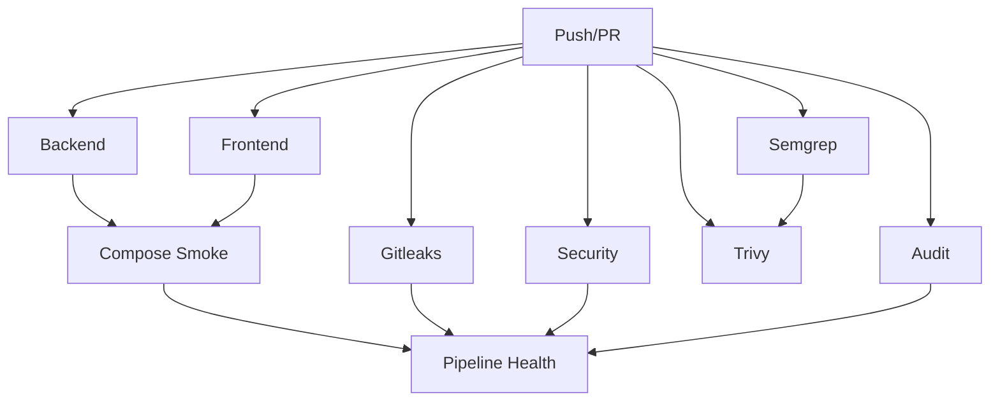

# CI/CD Pipeline Documentation

This guide covers the GitHub Actions CI/CD pipeline for the AI Real Estate Assistant project.

## Table of Contents

- [Overview](#overview)
- [Pipeline Architecture](#pipeline-architecture)
- [Jobs](#jobs)
- [Local CI Parity](#local-ci-parity)
- [Pipeline Maintenance](#pipeline-maintenance)
- [Troubleshooting](#troubleshooting)

---

## Overview

The CI/CD pipeline is defined in `.github/workflows/ci.yml` and runs on:

- Push to `main`, `dev`, or `ver4` branches
- Pull requests targeting `main`, `dev`, or `ver4`
- Manual workflow dispatch

### Pipeline Goals

1. **Security**: Detect secrets and vulnerabilities
2. **Quality**: Enforce code style and type safety
3. **Testing**: Verify functionality with coverage gates
4. **Deployment**: Ensure Docker images build correctly

---

## Pipeline Architecture



### Jobs Table

| Job | Purpose | Duration | Failure Impact |
|-----|---------|----------|----------------|
| `gitleaks` | Secret detection | ~30s | High (blocks PR) |
| `backend` | Lint, type check, tests | ~5-8min | High (blocks PR) |
| `frontend` | Lint, tests | ~2-3min | High (blocks PR) |
| `security` | Bandit SAST | ~1min | Medium |
| `audit` | pip-audit vulnerability scan | ~30s | Medium |
| `semgrep` | Security rules | ~1-2min | Low |
| `trivy` | Container vulnerability scan | ~3-5min | Low |
| `compose_smoke` | Docker build + health check | ~5-10min | Medium |

---

## Jobs

### Gitleaks

Detects committed secrets (API keys, tokens, passwords).

**Config:** `.gitleaks.toml`

**Excludes:**
- `.env.example` (example values)
- `*.test.js`, `*.spec.ts` (test files)

**On Failure:**
- Review the leaked secret
- Rotate the secret immediately
- Remove from git history (git filter-repo or BFG)
- Update `.gitleaks.toml` if false positive

### Backend

Comprehensive Python testing pipeline.

**Steps:**
1. Install dependencies (with caching)
2. Lint (ruff)
3. Type check (mypy)
4. Rule engine test
5. Forbidden token scan
6. OpenAPI schema drift check
7. API reference drift check
8. Unit tests with coverage
9. Coverage gates (diff + critical)
10. Integration tests with coverage

**Coverage Gates:**

| Gate | Minimum | Scope |
|------|---------|-------|
| Unit Diff | 90% | Changed files only |
| Unit Critical | 90% | Core modules |
| Integration Diff | 70% | Changed files only |

**Critical Modules:**
- `api/*.py`
- `api/routers/*.py`
- `rules/*.py`
- `models/provider_factory.py`
- `models/user_model_preferences.py`
- `config/*.py`

### Frontend

JavaScript/TypeScript testing pipeline.

**Steps:**
1. Install dependencies (with caching)
2. Lint (ESLint)
3. Tests with coverage (Jest)

**Coverage Requirements:**
- Lines: ≥85%
- Statements: ≥85%
- Functions: ≥85%
- Branches: ≥70%

### Security

Bandit SAST scanning for Python security issues.

**Excluded:** `tests/`, `node_modules/`, `.history/`, `venv/`

**Severity:** High and confidence level high only

**Report:** Uploaded as artifact

### Audit

pip-audit for dependency vulnerability scanning.

**Fail Condition:** Vulnerabilities found (continue-on-error in CI)

**Report:** Uploaded as artifact

### Semgrep

Security rules scanning using custom `semgrep.yml`.

**Rules:**
- SQL injection patterns
- XSS vulnerabilities
- Command injection
- Insecure deserialization

**Report:** Uploaded to Semgrep Cloud (if configured)

### Trivy

Container vulnerability scanning.

**Images:**
- Backend: `deploy/docker/Dockerfile.backend`
- Frontend: `deploy/docker/Dockerfile.frontend`

**Severity:** CRITICAL and HIGH only

**Unfixed:** Ignored (configuration bugs, not malicious)

### Compose Smoke

Docker Compose smoke test.

**Steps:**
1. Build Docker images
2. Start containers
3. Wait for health checks
4. Verify services respond

**Timeout:** 10 minutes

**Retry:** Once on failure (for transient issues)

### Pipeline Health

Final summary job that:
- Aggregates all job results
- Posts summary to GitHub run summary
- Creates/fails based on job results
- Reports non-success jobs

---

## Local CI Parity

Run the full CI pipeline locally before pushing.

### Quick CI

```bash
make ci-quick
```

Runs: Lint, type check, quick tests (skips slower scans).

### Full CI

```bash
make ci
```

Or:

```bash
python scripts/workflows/full_ci.py
```

### Manual CI Reproduction

#### Backend CI

```powershell
# Install uv
pip install uv

# Install dependencies
uv pip install -e .[dev]

# Lint
python -m ruff check .

# Type check
python -m mypy

# Rule engine test
python -m pytest -q tests/integration/test_rule_engine_clean.py

# OpenAPI schema check
python scripts/docs/export_openapi.py --check

# API reference check
python scripts/docs/generate_api_reference.py --check

# Unit tests with coverage
python -m pytest tests/unit --cov=. --cov-report=xml --cov-report=term -n auto

# Coverage gates
python scripts/ci/coverage_gate.py diff --coverage-xml coverage.xml --min-coverage 90 --exclude tests/* --exclude scripts/* --exclude workflows/*
python scripts/ci/coverage_gate.py critical --coverage-xml coverage.xml --min-coverage 90 --include api/*.py --include api/routers/*.py --include rules/*.py --include models/provider_factory.py --include models/user_model_preferences.py --include config/*.py

# Integration tests
python -m pytest tests/integration --cov=. --cov-report=xml --cov-report=term
```

#### Frontend CI

```powershell
cd apps/web

# Install dependencies
npm ci

# Lint
npm run lint

# Tests with coverage
npm run test:ci
```

#### Security CI

```powershell
# Install tools
uv pip install bandit pip-audit

# Bandit
python -m bandit -r apps/api -x tests,node_modules,.history,venv --severity-level high --confidence-level high -f json -o artifacts/bandit.json

# pip-audit
python -m pip_audit -r requirements.txt -f json -o artifacts/pip-audit.json

# Semgrep (requires installation)
semgrep scan --config semgrep.yml --error
```

---

## Pipeline Maintenance

### Review Pipeline Health

Pipeline health issues are created when jobs fail.

```bash
# List recent runs
gh run list -R AleksNeStu/ai-real-estate-assistant --limit 10

# View specific run
gh run view -R AleksNeStu/ai-real-estate-assistant <run_id>

# View failed logs
gh run view -R AleksNeStu/ai-real-estate-assistant <run_id> --log-failed
```

### Re-run Failed Jobs

```bash
# Re-run specific job
gh run rerun -R AleksNeStu/ai-real-estate-assistant <run_id>

# Re-run all failed jobs
gh run rerun -R AleksNeStu/ai-real-estate-assistant <run_id> --failed
```

### Update Dependencies

For flaky tests due to dependency updates:

```bash
# Update Python dependencies
cd apps/api
uv pip install --upgrade <package>
pip freeze > requirements.txt

# Update Node dependencies
cd apps/web
npm update <package>
npm install
```

### Coverage Gate Adjustments

To adjust coverage thresholds:

1. Edit `scripts/ci/coverage_gate.py` or CI workflow
2. Document rationale in commit message
3. Get team approval for reduced thresholds

---

## Troubleshooting

### Issue: Integration Test Flake

**Symptom:** Tests pass locally, fail in CI intermittently.

**Cause:** Async indexing racing with shared in-memory Chroma state.

**Solution:**
- CI retries integration tests once automatically
- Consider using file-backed Chroma for tests
- Add explicit waits in tests

### Issue: Coverage Gate Failure

**Symptom:** New code doesn't meet coverage requirements.

**Solution:**
```bash
# Check coverage locally
pytest tests/unit --cov=. --cov-report=html
open htmlcov/index.html

# Find uncovered lines and write tests
```

### Issue: Docker Build Timeout

**Symptom:** `compose_smoke` job times out.

**Cause:** Slow build or health check failure.

**Solution:**
- Check logs in GitHub Actions
- Verify health check endpoints
- Consider increasing timeout in workflow

### Issue: Gitleaks False Positive

**Symptom:** Legitimate value flagged as secret.

**Solution:**
```toml
# In .gitleaks.toml
[[rules.allowlist]]
regex = '''your-pattern-here'''
```

### Issue: Semgrep Not Available

**Symptom:** `semgrep: command not found`.

**Solution:**
```bash
# Install Semgrep
python -m pip install semgrep

# Or use Docker
docker pull returntocorp/semgrep
```

### Issue: npm EPERM on Windows

**Symptom:** `npm ci` fails with EPERM.

**Solution:**
```powershell
# Delete node_modules and reinstall
Remove-Item -Recurse -Force apps/web/node_modules
cd apps/web
npm ci
```

---

## Pipeline Optimization

### Caching Strategy

The pipeline uses GitHub Actions caching for:

| Cache | Key | Restore Keys |
|-------|-----|--------------|
| uv | `${{ runner.os }}-uv-${{ hashFiles(...) }}` | `${{ runner.os }}-uv-` |
| npm | `${{ runner.os }}-node-${{ hashFiles(...) }}` | `${{ runner.os }}-node-` |

### Parallel Execution

Jobs run in parallel by default. Dependencies:

```
compose_smoke depends on: [backend, frontend]
pipeline_health depends on: [all jobs]
```

### Retry Strategy

Jobs with automatic retry:

| Job | Retry Condition | Max Retries |
|-----|-----------------|-------------|
| integration tests | Any failure | 1 |
| compose_smoke | Any failure | 1 |

---

## Related Documentation

- [Testing Guide](testing.md)
- [Deployment Guide](deployment.md)
- [Troubleshooting Guide](troubleshooting.md)
